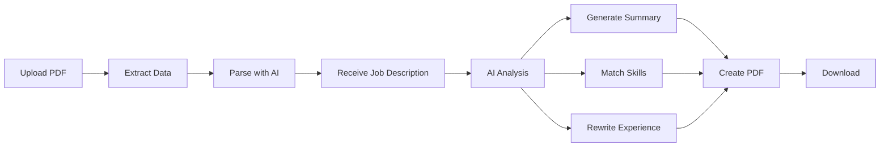

# 🎯 AI Resume Tailor

An intelligent, AI-powered resume tailoring system that automatically customizes your resume for specific job descriptions and generates professional, ATS-friendly PDF outputs.

[](https://nextjs.org/)
[](https://openai.com/)
[](https://nodejs.org/)
[](LICENSE)

---

## 🚀 Features

### 🤖 AI-Powered Resume Tailoring
- **Intelligent Content Generation**: Uses OpenAI GPT-4o to rewrite your resume for each job
- **ATS Optimization**: Automatically includes keywords and phrases from job descriptions
- **Skills Matching**: Balances JD-specific skills (60%) with related modern technologies (40%)
- **Experience Enhancement**: Generates 7-8 detailed, results-driven bullet points per position
- **Professional Summaries**: Creates compelling 5-6 line summaries tailored to each role

### 📄 PDF Processing & Generation
- **PDF to JSON Conversion**: Upload any resume PDF and convert it to structured JSON
- **Professional Templates**: Clean, ATS-friendly design optimized for applicant tracking systems
- **Drag & Drop Interface**: Simple, intuitive file upload experience
- **Instant Downloads**: Generate tailored PDFs in 30-90 seconds

### 💼 Smart Filename Management
- **Automatic Naming**: Files named as `Firstname_Lastname_Company.pdf`
- **Proper Capitalization**: Professional formatting with title case
- **Company Integration**: Optional company name in filename for easy organization

### 🎨 User Experience
- **Single-Page Workflow**: Upload PDF → Add job description → Generate tailored resume
- **Real-time Feedback**: Visual indicators for file upload and processing status
- **No Pre-configuration**: Works instantly with any resume PDF

---

## 📋 Prerequisites

Before you begin, ensure you have the following installed:

- **Node.js** (v20.x or higher)
- **npm** (comes with Node.js)
- **OpenAI API Key** (sign up at [platform.openai.com](https://platform.openai.com))

---

## ⚙️ Installation

### 1. Clone the Repository

```bash
git clone https://github.com/yourusername/resume-tailor.git
cd resume-tailor
```

### 2. Install Dependencies

```bash
npm install
```

### 3. Configure Environment Variables

Create a `.env` file in the root directory:

```env
OPENAI_API_KEY=sk-your-openai-api-key-here
OPENAI_VERSION=gpt-4o-mini
```

**OpenAI Model Options:**

| Model | Speed | Quality | Cost per Resume | Best For |
|-------|-------|---------|----------------|----------|
| `gpt-4o-mini` | ⚡ Fast | ✅ Good | $0.01-0.02 | Most users |
| `gpt-4o` | ⏱️ Medium | ⭐ Excellent | $0.03-0.05 | High quality |
| `gpt-4-turbo` | 🐌 Slow | 🌟 Best | $0.05-0.10 | Premium quality |

### 4. Start the Development Server

```bash
npm run dev
```

Open [http://localhost:3000](http://localhost:3000) in your browser.

---

## 🎯 Usage

### Quick Start (3 Simple Steps)

1. **Upload Your Resume**
   - Drag and drop your PDF resume, or click to browse
   - The system will extract your contact info and work history

2. **Add Job Details (Optional)**
   - Enter the company name (optional)
   - Paste the complete job description

3. **Generate Tailored Resume**
   - Click "Generate Tailored Resume PDF"
   - Wait 30-90 seconds for AI processing
   - Your customized resume downloads automatically

### Example Workflow

```
📄 Upload: John_Doe_Resume.pdf
🏢 Company: Google (optional)
📋 Job Description: [Paste full JD]
⬇️ Download: John_Doe_Google.pdf
```

---

## 🏗️ Project Structure

```
resume-tailor/
├── pages/
│   ├── index.js              # Main UI - Upload & generate
│   ├── parse.js              # PDF parser standalone page
│   └── api/
│       ├── generate.js       # Resume generation + PDF creation
│       ├── parse-resume.js   # PDF to JSON conversion
│       └── resume-list.js    # Lists saved resumes
├── templates/
│   └── Resume.html           # Handlebars PDF template
├── resumes/
│   └── _template.json        # Resume JSON template
├── .env                      # Environment variables (create this)
├── .gitignore
├── package.json
└── README.md
```

---

## 📊 How It Works

### The AI Tailoring Process



### What the AI Does

1. **Analyzes Job Description**: Extracts required skills, technologies, and keywords
2. **Writes New Summary**: 5-6 lines highlighting relevant expertise and alignment
3. **Optimizes Skills Section**:
   - 60% skills directly from JD
   - 40% related modern technologies
   - 12-18 skills per category
4. **Rewrites Experience**:
   - 7-8 detailed bullets per position
   - Includes JD keywords and required technologies
   - Emphasizes measurable outcomes and business impact
   - Realistic tech stacks for each time period
5. **Generates Professional PDF**: Clean, ATS-friendly format ready to submit

---

## 🎨 Resume JSON Structure

The system uses a structured JSON format for resumes:

```json
{
  "name": "John Doe",
  "title": "Senior Software Engineer",
  "email": "john.doe@example.com",
  "phone": "+1 234 567 8900",
  "location": "San Francisco, CA",
  "linkedin": "https://www.linkedin.com/in/johndoe",
  "website": "",
  "summary": "",
  "skills": {
    "Programming Languages": ["JavaScript", "TypeScript", "Python"],
    "Frontend": ["React", "Next.js", "Vue.js"],
    "Backend": ["Node.js", "Express", "FastAPI"],
    "Cloud Platforms": ["AWS", "Azure", "GCP"],
    "DevOps & Infrastructure": ["Docker", "Kubernetes", "Terraform"]
  },
  "experience": [
    {
      "title": "Senior Software Engineer",
      "company": "Tech Company",
      "location": "San Francisco, CA",
      "start_date": "Jan 2020",
      "end_date": "Present",
      "details": []
    }
  ],
  "education": [
    {
      "degree": "Bachelor of Science in Computer Science",
      "school": "University Name",
      "start_year": "2012",
      "end_year": "2016"
    }
  ]
}
```

**Key Fields:**
- `summary`: Left empty - AI fills during generation
- `skills`: Pre-populated with comprehensive tech stack
- `details`: Empty arrays - AI populates with tailored bullets

---

## 🎨 PDF Template Customization

The PDF template uses Handlebars syntax and can be customized:

### Default Template Features
- ✅ Clean, professional design
- ✅ ATS-friendly (no colors, standard fonts)
- ✅ Optimized spacing for 1-2 pages
- ✅ Calibri/Arial fonts (industry standard)
- ✅ Clear section hierarchy

### Customizing the Template

Edit `templates/Resume.html`:

```html
<!-- Change fonts -->
body {
  font-family: "Calibri", "Arial", sans-serif;
}

<!-- Adjust margins -->
.exp-details {
  margin-left: 18px;
}

<!-- Modify section headers -->
section h2 {
  font-size: 11.5pt;
  border-bottom: 1.5pt solid #000000;
}
```

---

## 🔧 Configuration

### Environment Variables

| Variable | Description | Required | Example |
|----------|-------------|----------|---------|
| `OPENAI_API_KEY` | Your OpenAI API key | ✅ Yes | `sk-proj-...` |
| `OPENAI_VERSION` | GPT model to use | ✅ Yes | `gpt-4o-mini` |

### Timeout Settings

Adjust AI request timeout in `pages/api/generate.js`:

```javascript
// Line 41: Increase timeout for slower models
async function callOpenAI(prompt, retries = 2, timeoutMs = 90000) {
  // 90000ms = 90 seconds
}
```

### PDF Margins

Customize PDF margins in `pages/api/generate.js`:

```javascript
// Line 182
const pdfBuffer = await page.pdf({
  format: "A4",
  printBackground: true,
  margin: { top: "13mm", bottom: "7mm", left: "0mm", right: "0mm" },
});
```

---

## 🐛 Troubleshooting

### Common Issues

| Issue | Cause | Solution |
|-------|-------|----------|
| "PDF generation failed" | Missing API key | Check `.env` file exists with valid `OPENAI_API_KEY` |
| "Request timed out" | Slow model or complex resume | Use `gpt-4o-mini` or increase timeout |
| PDF text not extracting | Scanned/image PDF | Use text-based PDF, not scanned images |
| Skills show as empty | Template mismatch | Skills populated during generation, not in base JSON |
| Port 3000 in use | Another app using port | Stop other Node processes or change port |

### Debug Mode

Enable detailed logging:

```javascript
// In pages/api/generate.js
console.log("Resume JSON:", resumeJson);
console.log("AI Response:", aiText);
```

### Testing OpenAI Connection

```bash
# Test your API key
curl https://api.openai.com/v1/models \
  -H "Authorization: Bearer $OPENAI_API_KEY"
```

---

## 🚀 Production Deployment

### Deploy to Vercel (Recommended)

1. **Install Vercel CLI**
   ```bash
   npm install -g vercel
   ```

2. **Deploy**
   ```bash
   vercel
   ```

3. **Add Environment Variables**
   - Go to Vercel Dashboard → Project Settings → Environment Variables
   - Add `OPENAI_API_KEY` and `OPENAI_VERSION`

4. **Done!**
   - Your app is live at `https://your-project.vercel.app`

### Other Deployment Options

- **Netlify**: Similar to Vercel, supports Next.js
- **AWS Amplify**: Full-stack deployment with AWS services
- **Docker**: Containerize with included Chromium for PDF generation
- **Traditional Hosting**: Build with `npm run build` and deploy static files

---

## 💰 Cost Estimates

Based on typical resume generation:

| Usage | Model | Monthly Cost* | Per Resume |
|-------|-------|--------------|------------|
| 10 resumes/month | gpt-4o-mini | ~$0.20 | $0.02 |
| 50 resumes/month | gpt-4o-mini | ~$1.00 | $0.02 |
| 10 resumes/month | gpt-4o | ~$0.50 | $0.05 |
| 50 resumes/month | gpt-4o | ~$2.50 | $0.05 |

*Estimates based on average resume complexity

---

## 🛡️ Security & Privacy

### Data Handling
- ✅ **No Data Storage**: Resume data is processed in-memory only
- ✅ **Secure API Keys**: Environment variables never exposed to browser
- ✅ **Server-side Processing**: All AI calls happen on the server
- ✅ **HTTPS Only**: Use HTTPS in production for encrypted transmission

### Best Practices
1. Never commit `.env` file to version control
2. Rotate API keys regularly
3. Set up rate limiting for public deployments
4. Use environment-specific API keys (dev/prod)

---

## 🤝 Contributing

Contributions are welcome! Here's how you can help:

### Development Setup

```bash
# Fork the repository
git clone https://github.com/yourusername/resume-tailor.git

# Create a feature branch
git checkout -b feature/amazing-feature

# Make your changes and commit
git commit -m "Add amazing feature"

# Push and create a Pull Request
git push origin feature/amazing-feature
```

### Code Style
- Use ES6+ syntax
- Follow existing code formatting
- Add comments for complex logic
- Test thoroughly before submitting

---

## 📝 Scripts

| Command | Description |
|---------|-------------|
| `npm run dev` | Start development server (port 3000) |
| `npm run build` | Build for production |
| `npm start` | Start production server |

---

## 🔗 Tech Stack

### Frontend
- **Next.js 14.1.0** - React framework with API routes
- **React 18.2.0** - UI library
- **Vanilla CSS** - No external styling libraries

### Backend
- **Node.js 20.x** - JavaScript runtime
- **OpenAI API** - GPT-4o for AI processing
- **Puppeteer Core** - Headless browser for PDF generation
- **Chromium** - Browser engine for rendering

### Libraries
- **Handlebars** - HTML templating for PDFs
- **pdf-parse** - Extract text from PDF files
- **formidable** - Handle file uploads
- **jsonc-parser** - Parse JSON with comments

---

## 📖 Documentation

### API Endpoints

#### `POST /api/parse-resume`
Converts PDF resume to JSON structure.

**Request:**
- Content-Type: `multipart/form-data`
- Body: PDF file

**Response:**
```json
{
  "success": true,
  "data": { /* Resume JSON */ }
}
```

#### `POST /api/generate`
Generates tailored resume PDF.

**Request:**
```json
{
  "resumeJson": { /* Resume object */ },
  "jd": "Job description text",
  "company": "Company name (optional)"
}
```

**Response:**
- Content-Type: `application/pdf`
- PDF file download

---

## 🎓 Learning Resources

- [Next.js Documentation](https://nextjs.org/docs)
- [OpenAI API Reference](https://platform.openai.com/docs)
- [Puppeteer Documentation](https://pptr.dev/)
- [Handlebars Guide](https://handlebarsjs.com/guide/)

---

## 📄 License

This project is licensed under the MIT License - see the [LICENSE](LICENSE) file for details.

---

## 🙏 Acknowledgments

- OpenAI for providing powerful GPT models
- Next.js team for the excellent framework
- The open-source community for amazing tools

---

## 📧 Support

For support, questions, or feedback:

- **Issues**: [GitHub Issues](https://github.com/yourusername/resume-tailor/issues)
- **Email**: your.email@example.com
- **Twitter**: [@yourhandle](https://twitter.com/yourhandle)

---

## 🗺️ Roadmap

### Coming Soon
- [ ] Multiple template options
- [ ] Resume history and versioning
- [ ] Batch processing for multiple jobs
- [ ] Custom skill category management
- [ ] LinkedIn profile import
- [ ] Cover letter generation
- [ ] A/B testing for different versions
- [ ] Resume scoring and suggestions

### Future Ideas
- [ ] Browser extension
- [ ] Mobile app
- [ ] Integration with job boards
- [ ] Team collaboration features
- [ ] Analytics dashboard

---

## ⭐ Show Your Support

If this project helped you land your dream job, please consider:

- ⭐ **Starring** the repository
- 🐛 **Reporting** bugs and issues
- 💡 **Suggesting** new features
- 🤝 **Contributing** code improvements
- 📢 **Sharing** with friends and colleagues

---

<div align="center">

**Built with ❤️ for job seekers everywhere**

[⬆ back to top](#-ai-resume-tailor)

</div>

